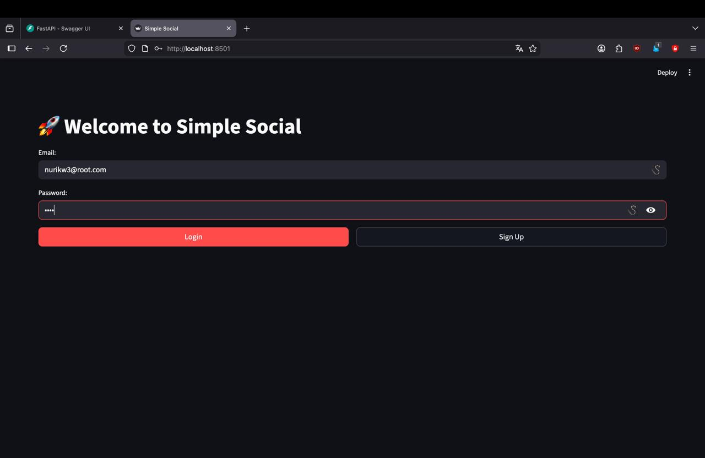
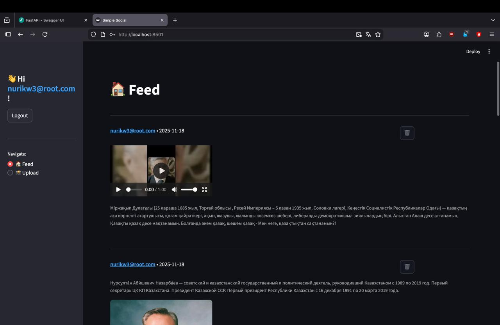
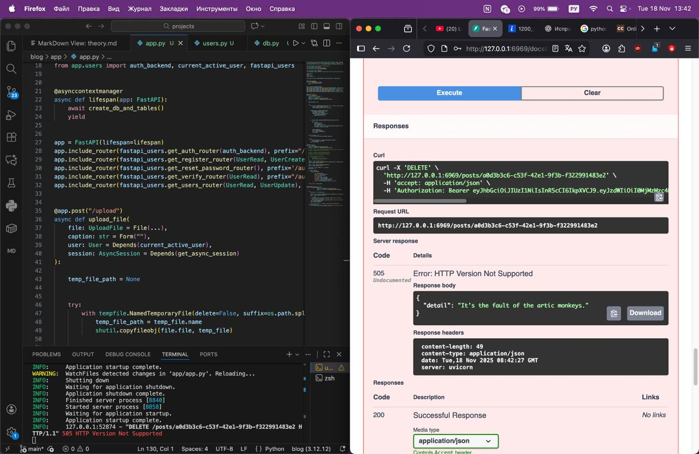

# Blog Pet

A blog application built with Python. This project demonstrates CRUD operations, user management, and media handling.

## Features
- User registration and authentication (jwt)
- Blog post creation, editing, and deletion (via cloud: https://imagekit.io/)
- Image upload and display

## Project Structure
```
blog/
├── app/
│   ├── app.py
│   ├── db.py
│   ├── images.py
│   ├── schemas.py
│   ├── users.py
├── frontend.py
├── index.html
├── main.py
├── pyproject.toml
├── README.md
├── theory.md
├── src/  # Contains screenshots and images
```

## How It Works
1. Start the backend server using `app/app.py` (localhost:6969).
2. Access the frontend via  `frontend.py` (localhost:8501) (and use httpx).
3. Register, log in, and create blog posts. (JWT, FastAPI-Users)
4. Upload images to showcase your posts. (via cloud: https://imagekit.io/)

## Screenshots
Below are some screenshots showing how the app works:


*Auth.*


*feed.*


*upload.*


*coding process.*

> Replace the image filenames above with your actual image files in the `src` folder.

## Setup
1. Clone the repository:
   ```sh
   git clone https://github.com/nurikw3/blog_pet.git
   ```
2. Install dependencies:
   ```sh
    uv sync
   ```
3. Start the application:
   ```sh
   uv run main.py
   ```